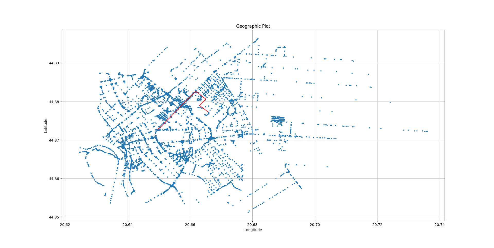

# GPS Navigation App

A high-performance C++ navigation engine that computes the shortest path between two points on a real map using **Dijkstra’s algorithm** and a custom **KD-Tree** for spatial indexing.

---

## Overview

This project implements a **from-scratch navigation system** — from map parsing to path visualization — optimized for both performance and scalability.

The system parses **OpenStreetMap (OSM)** data via [libosmium](https://osmcode.org/libosmium/), constructs an efficient **graph representation** of the road network, and computes routes using a fine-tuned version of **Dijkstra’s algorithm** combined with a **KD-Tree** for fast nearest-node lookups.

---
